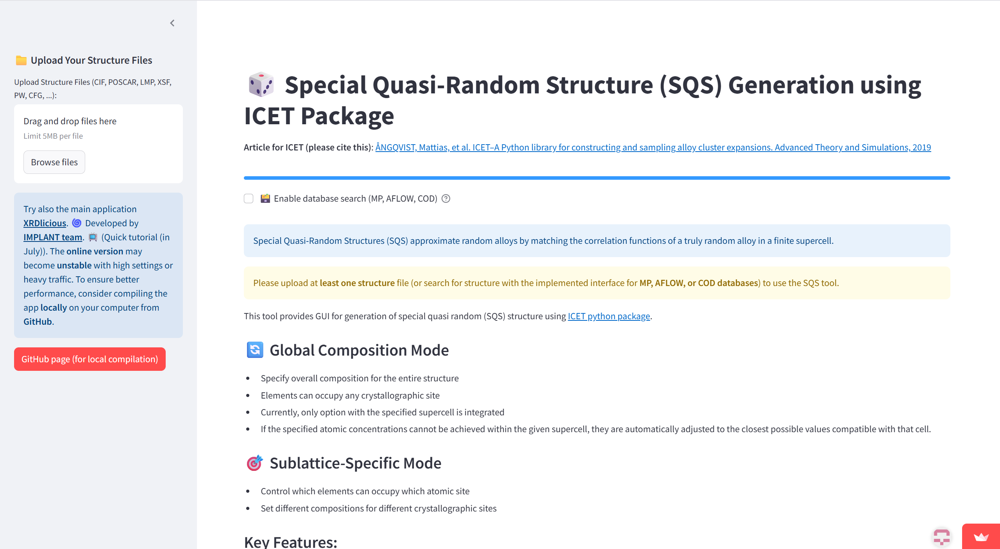
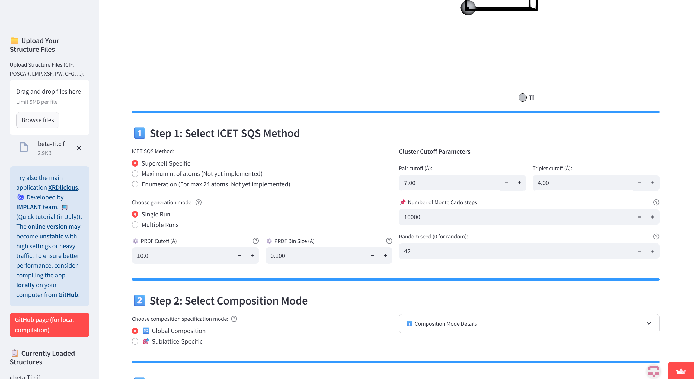
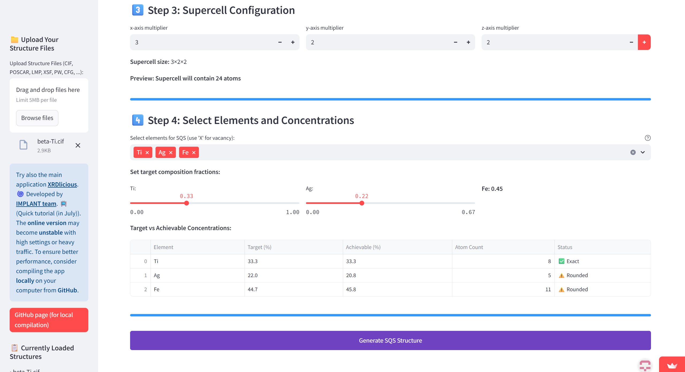
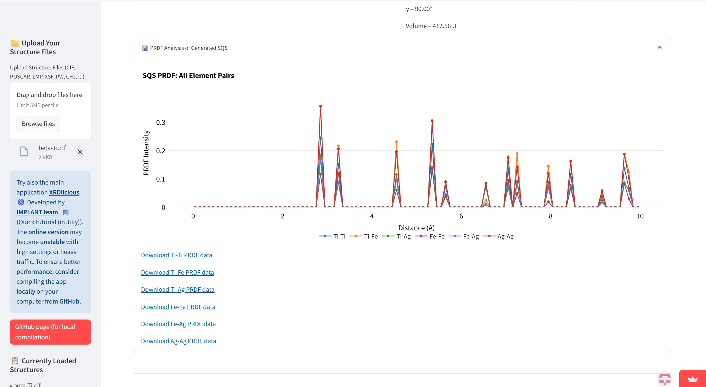

# SQS-GUI
GUI for generating SQS structures using ICET package. Try the application online at https://sqs-icet.streamlit.app/ or compile it locally (see the manual below). 
Currently, there is implemented only supercell-specific option.  

**Keep in mind that the online version should be used only for illustrative purposes of the application or light-weight task. For computational demanding tasks, compile the application locally.** 

### **Prerequisities**: 
- Python 3.x (Tested 3.12)
- Console (For Windows, I recommend to use WSL2 (Windows Subsystem for Linux))
- Git (optional for downloading the code)

### **Compile the app**  
Open your terminal console and write the following commands (the bold text):  
(Optional) Install Git:  
      **sudo apt update**  
      **sudo apt install git**    
      
1) Download the XRDlicious code from GitHub (or download it manually without Git on the following link by clicking on 'Code' and 'Download ZIP', then extract the ZIP. With Git, it is automatically extracted):  
      **git clone https://github.com/bracerino/SQS-GUI.git**

2) Navigate to the downloaded project folder:  
      **cd SQS-GUI/**

3) Create a Python virtual environment to prevent possible conflicts between packages:  
      **python3 -m venv sqs_env**

4) Activate the Python virtual environment (before activating, make sure you are inside the SQS-GUI folder):  
      **source sqs_env/bin/activate**
   
5) Install all the necessary Python packages:  
      **pip install -r requirements.txt**

6) Run the SQS-GUI app (always before running it, make sure to activate its Python virtual environment (Step 4):  
      **streamlit run app.py**

### **Tested versions of Python packages**
Python 3.12.3  

- numpy==1.26.4  
- matplotlib==3.10.3  
- ase==3.25.0  
- matminer==0.9.3  
- pymatgen==2025.5.28
- icet==3.0
- llvmlite==0.44.0
- numba==0.61.24 
- plotly==6.1.2  
- streamlit-plotly-events==0.0.6  
- setuptools==80.9.0  
- mp-api==0.45.3  
- aflow==0.0.11  
- pillow==11.2.1  
- pymatgen-analysis-defects==2025.1.18
- psutil==7.0.0  

### SQS generation workflow 
- Upload your crystal structure or select it from the implemented search interface in MP, AFLOW, or COD databases.
- Select which method to use for the generation of SQS (currently only supercell-specific is implemented). Select if you want to perform only one run or multiple runs (one by one). In multiple runs, you can download all best found structures in each run.
- Select composition mode, i.e. define the element composition for all atomic sites, or select specific sites and define composition on them (sublattices).

- Set how large should be the searched SQS (set the supercell parameters).
- Set the elements and their concentration (either for all atomic sites in global composition mode, or set first the atomic sites and then define their elements and concentrations in sublattice mode).
- Click button to generate sqs structure.

- See the found SQS and download its output file.

- See the partial radial distribution function (PRDF) for the found SQS.

