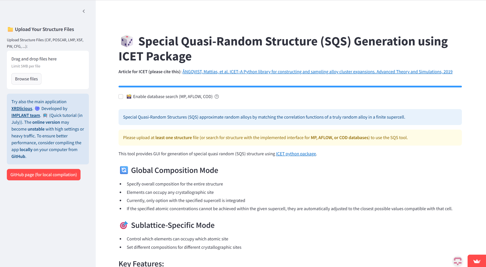
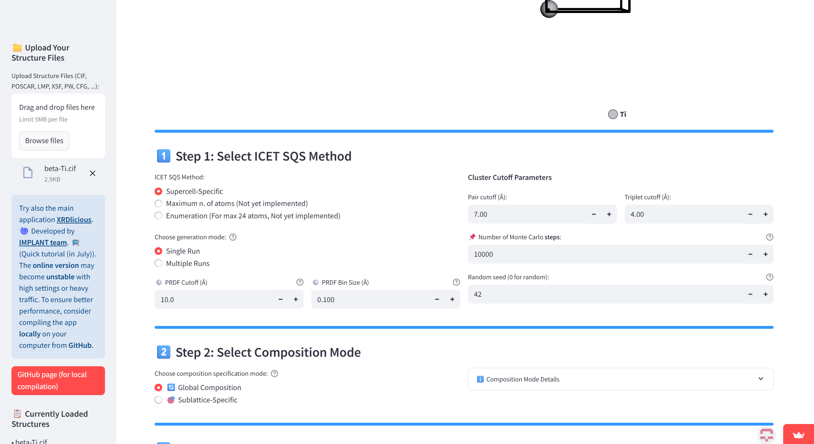
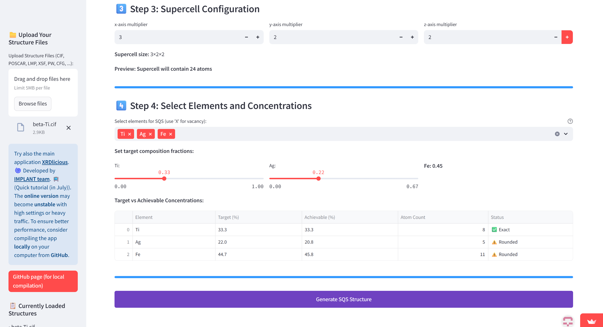
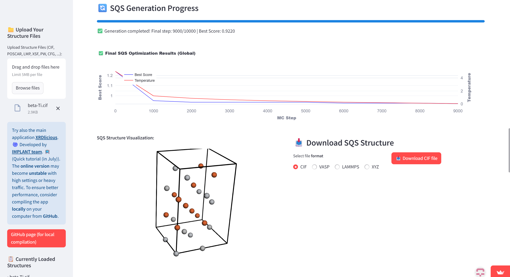
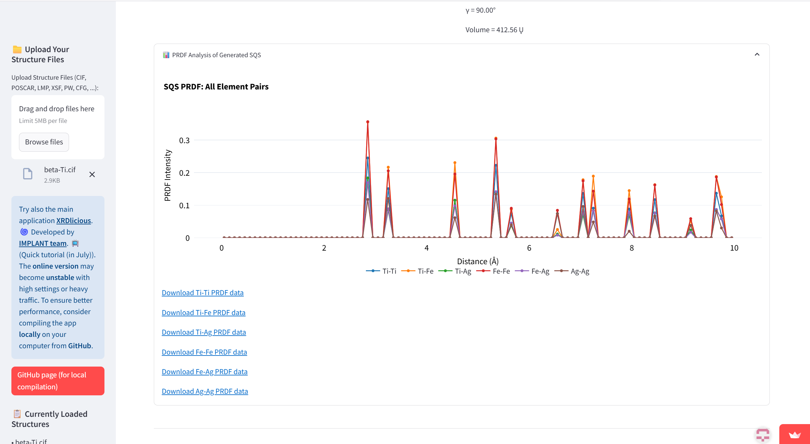

# ICET-SQS
**Release: v0.2 — updated August 22, 2026**

GUI for generating SQS structures using ICET package. Try the application online at https://icet-sqs.streamlit.app/ or compile it locally (see the manual below). 
Currently, there is implemented only supercell-specific option.  

**Keep in mind that the online version should be used only for illustrative purposes of the application or light-weight task. For computational demanding tasks, compile the application locally.** 

### **Prerequisities**: 
- Python 3.x (Tested 3.12)
- Console (For Windows, I recommend to use WSL2 (Windows Subsystem for Linux))
- Git (optional for downloading the code)

### **Compile the app**  
Open your terminal console and write the following commands (the bold text):  
(Optional) Install Git:  
      **sudo apt update**  
      **sudo apt install git**    
      
1) Download the code from GitHub (or download it manually without Git on the following link by clicking on 'Code' and 'Download ZIP', then extract the ZIP. With Git, it is automatically extracted):  
      **git clone https://github.com/bracerino/icet-sqs-gui.git**

2) Navigate to the downloaded project folder:  
      **cd icet-sqs-gui/**

3) Create a Python virtual environment to prevent possible conflicts between packages:  
      **python3 -m venv sqs_env**

4) Activate the Python virtual environment (before activating, make sure you are inside the icet-sqs-gui folder):  
      **source sqs_env/bin/activate**
   
5) Install all the necessary Python packages:  
      **pip install -r requirements.txt**

6) Run the ICET-SQS app (always before running it, make sure to activate its Python virtual environment (Step 4):  
      **streamlit run app.py**

### **Tested versions of Python packages**
Python 3.12.3  
- streamlit==1.62.0
- numpy==2.2.6
- matplotlib==3.10.3  
- ase==3.25.0
- pandas==2.2.3  
- matminer==0.9.3  
- pymatgen==2025.5.28
- icet==3.0
- llvmlite==0.44.0
- numba==0.61.24 
- plotly==6.1.2  
- streamlit-plotly-events==0.0.6  
- setuptools==80.9.0  
- mp-api==0.45.3  
- aflow==0.0.11  
- pillow==11.2.1  
- pymatgen-analysis-defects==2025.1.18
- psutil==7.0.0  
- plotly==6.1.1  
- py3Dmol==2.4.2    
- scipy==1.15.3 
- scikit-learn==1.6.1  
- sympy==1.14.0  
- spglib==2.6.0  
- networkx==3.4.2  
- requests==2.32.3

### SQS generation workflow 
- In a hurry? Pick a lattice from the **Example crystal structure** selector on the landing page
and press **🎲 Load example alloy** — it loads an equiatomic random alloy (BCC MoNbTa, FCC CoCrFeNi,
SC VNbTa or HCP TiZrHf) and pre-fills every SQS parameter (3×3×3 supercell, 3 runs of 50 000 MC
steps, 3 in parallel for the console script), so you only have to press Generate.
- Upload your crystal structure or select it from the implemented search interface in MP, AFLOW, or COD databases.
- Press **🔍 Check cutoff vs supercell** (next to *Generate Standalone Script*) to have the app
verify this for you with ICET's own `is_supercell_self_interacting`. It reports either the
headroom you have left, or the largest cutoff that fits the current cell **and** the smallest
supercell that fits the current cutoff.
- Keep the **pair cutoff** below half the shortest supercell lattice vector. Above that a pair
cluster wraps around onto its own periodic image. The default 5 Å suits the usual 64–108 atom cells
(e.g. 3×3×3 of a conventional fcc cell is fine at 5 Å but self-interacting at 6 Å); raise it
only together with a larger supercell.
- Select which method to use for the generation of SQS: **Supercell-Specific** (Monte Carlo
annealing on the supercell you set) or **Enumeration** (exhaustive — it walks every
symmetry-inequivalent structure of that size and so returns the provably best one).
- Enumeration is combinatorial, so before it can be started you must press
**🔢 Estimate the number of combinations**. That reports how many arrangements your cell
admits, how many distinct cell shapes of the same size exist, a rigorous upper bound on the
candidates, and — when that looks tractable — runs the real enumerator for a few seconds to
measure the actual count and time. It then says plainly whether to enumerate or to use Monte
Carlo instead, and the Generate button stays disabled while the answer is "too large". Select if you want to perform only one run or multiple runs (one by one). In multiple runs, you can download all best found structures in each run.
- Select composition mode, i.e. define the element composition for all atomic sites, or select specific sites and define composition on them (sublattices).
- One species may be allowed on **one sublattice only**. ICET groups sites by their set of
allowed elements and cannot tell two atoms of the same species apart, so e.g. Ti on both an
A-site and a B-site is rejected. Either give those Wyckoff positions the same set of elements
(they then form one sublattice sharing one concentration), or make their element sets disjoint.
Both the app and `run_sqs_icet.py` check this before the search starts.
- In sublattice mode, every unique Wyckoff position gets its own tab. Pick the elements allowed on it and set their fractions; the settings apply automatically to all symmetry-equivalent sites. The 🔀 toggle decides whether sites sharing element + Wyckoff letter are merged into one sublattice or split into separate ones, and the 🔢 toggle swaps the sliders for number inputs. Concentrations snap to the smallest fraction the supercell can actually realise, so the target you set is the composition you get.

- Set how large should be the searched SQS (set the supercell parameters).
- Set the elements and their concentration (either for all atomic sites in global composition mode, or set first the atomic sites and then define their elements and concentrations in sublattice mode).
- Click button to generate sqs structure.

- See the found SQS and download its output file.

- See the partial radial distribution function (PRDF) for the found SQS.

### Running the search from the console (`run_sqs_icet.py`)

For long searches, batch jobs or clusters, the repository ships a standalone script that
performs the same ICET search without a browser. It is the ICET counterpart of the
`monitor.sh` produced by the [ATAT SQS GUI](https://github.com/bracerino/atat-sqs-gui).

Download a copy pre-filled with everything you configured in the app from the
**🐍 Standalone Script for the Console** panel (below the composition settings), or run the
script in this folder directly:

      python run_sqs_icet.py --structure POSCAR --supercell 3 3 3 --elements Fe:0.5,Ni:0.5 --steps 20000 --runs 4
      python run_sqs_icet.py --config my_config.json
      python run_sqs_icet.py --method enumeration --supercell 12 1 1
      python run_sqs_icet.py --estimate --supercell 12 1 1
      python run_sqs_icet.py --help

The number of runs follows *Choose generation mode* / *Number of runs* in 1️⃣ Step 1 of the
app, so the script repeats exactly what the app would do.

While it runs it prints the cluster space and one progress line per reported MC step with
the temperature, the accepted trials and the best score. When it finishes (or on Ctrl+C)
it writes everything into the output directory (by default the folder it is run from):

| file / folder | what it holds |
| --- | --- |
| `structures/` | every run's SQS in the formats you picked (POSCAR, CIF, LAMMPS, XYZ) |
| `POSCAR_best_overall`, `best_sqs.cif` | the best run, copied to the top level |
| `sqs_progress.csv` | best score, temperature and accepted trials per MC step |
| `cluster_vector_run*.csv` | SQS vs target cluster vector, per orbit |
| `icet_sqs.log` | ICET's own log |
| `objective_plots/` | best score vs MC step — per run, overlaid, and zoomed on the tail |
| `cluster_vector_plots/` | SQS vs target cluster vector and the mismatch, with a match score |
| `prdf_plots/` | partial RDF of the best structure |
| `sqs_summary.txt` | the summary table printed at the end |

With **Multiple Runs**, a **⚡ Runs in parallel** setting sits next to *Number of runs* in
1️⃣ Step 1 (or `--parallel N` on the command line). It applies to the console script; the
in-browser generation always runs them one at a time.
Each parallel run gets its own process; the console shows one consolidated status line for all
workers, and every run's structure, CSV and plots are written the moment that run finishes
rather than at the end:

      [   9.5 s] R1  78% 0.2810 | R2  78% 0.2810 | R3 ⏳ ------ | R4 ⏳ ------
      [  16.7 s] R1 ✅ 0.2810 | R2 ✅ 0.2810 | R3  44% 0.2810 | R4  44% 0.2810
      ✅ run 2 finished in 3.6 s | best score 0.281000 | match score 96.12 %

`⏳` is queued, a percentage is in progress, `✅` is finished — finished runs keep showing
their final objective value so the runs stay directly comparable while the rest are going.

### Why a run can have a better score but a worse match %

ICET does not score a candidate by its average error. Its objective is

      score = sum |cv - target|  -  optimality_weight * longest_optimal_radius

where `longest_optimal_radius` is the radius (in Å) of the furthest pair shell such that
*every* pair shell up to it matches the target **exactly**. That second term is measured in
ångström and is usually much larger than the first, so the score deliberately rewards getting
the near-neighbour shells exactly right over spreading the error evenly. The `match %` reported
here is `100 · (1 − RMSE)` over all orbits, which weights every orbit equally and ignores the
perfectly-matched prefix. The two therefore disagree, and both are meaningful: the score is
the physically motivated one, the match % is the plain goodness-of-fit. The summary table
prints the decomposition (`sum|dev|` and `perfect`) so you can see which term drove the score.

With `--method enumeration` the script enumerates exhaustively instead of annealing. It first
counts the candidates (up to `--count-timeout` seconds) so the progress line can count down —
`scored 1,251/1,552 (80.6 %) | 301 left | best score -0.916984 | 4.3 s elapsed, ~1.0 s to go` —
and falls back to a running total when counting would cost too much. `--estimate` sizes the
problem up and exits without searching.

Vacancies use the symbol `X`, exactly as in the app, and are removed from the saved
structures. The script needs icet, ase, pymatgen, numpy and matplotlib; matminer is only
used for the PRDF plot and the script skips it when matminer is missing.
